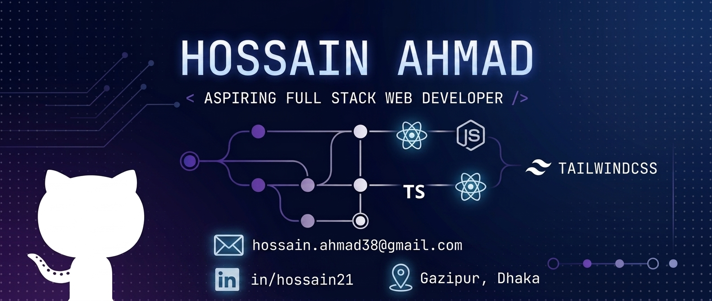

<div align="center">



</div>

<div align="center">

# 👋 Hi, I'm Hossain Ahmad

### 💻 Assistant Programmer · Aspiring Full-Stack Web Developer

<p>
  <a href="https://github.com/hossainahmad">
    
  </a>
  <a href="https://github.com/hossainahmad">
    
  </a>
</p>

<p>
  <i>Learning. Building. Improving — one project at a time.</i>
</p>

</div>

---

## 👋 About Me

I'm **Hossain Ahmad** — an **Assistant Programmer at Gazipur City Corporation** and an aspiring **Full-Stack Web Developer**.

I enjoy building modern, responsive, and user-friendly web applications. I'm continuously strengthening my fundamentals, learning modern technologies, and turning what I learn into practical projects.

- 💻 Currently focused on **JavaScript, TypeScript, and React**
- 🌱 Working toward becoming a **professional Full-Stack Developer**
- 🧠 Interested in clean code, problem-solving, and real-world applications
- 🚀 Learning by building projects and improving every day
- 📍 Gazipur, Dhaka, Bangladesh

---

## 🛠️ Tech Stack

### Frontend
<p></p>

### Backend & Database
<p></p>

### Tools
<p></p>

---

## 📚 Currently Learning

- 🟨 Advanced JavaScript / ES6+
- 🔷 TypeScript
- ⚛️ React
- 🌐 Modern Frontend Development
- 🔧 Git & GitHub
- 🧩 Building real-world projects
- 🧠 Problem solving and clean code

### My Learning Path

```text
HTML → CSS → JavaScript → ES6+ → TypeScript → React
                                             ↓
                                   Full-Stack Development
```

---

## 🔥 GitHub Streak

<div align="center">

<a href="https://github.com/hossainahmad">
  
</a>

</div>

---


## 🚀 Featured Project

### 📢 DevConf — Conference Landing Page

A responsive conference website created as a frontend development project.

**Tech:** HTML · CSS

- 🌐 [Live Demo](https://hossainahmad.github.io/A01-DevConf/)
- 💻 [Source Code](https://github.com/hossainahmad/A01-DevConf)

---

## 🎯 My 2026 Goals

- [ ] Master modern JavaScript
- [ ] Become confident with TypeScript
- [ ] Build strong React projects
- [ ] Build and deploy real-world applications
- [ ] Improve problem-solving skills
- [ ] Learn backend development
- [ ] Become a professional Full-Stack Developer
- [ ] Contribute to open-source projects

---

## 💡 Developer Philosophy

> **Don't just learn a technology — build something with it.**

I believe becoming a better developer comes from **consistent learning, hands-on projects, debugging, problem-solving, and continuous improvement**.

---

## 🤝 Let's Connect

<p align="center">

<a href="mailto:hossain.ahmad38@gmail.com">
  
</a>

<a href="https://www.linkedin.com/in/hossain21/">
  
</a>

<a href="https://github.com/hossainahmad">
  
</a>

</p>

---

<div align="center">

### ⭐ Thanks for visiting my profile!

<i>Keep learning · Keep building · Keep improving 🚀</i>

</div>
